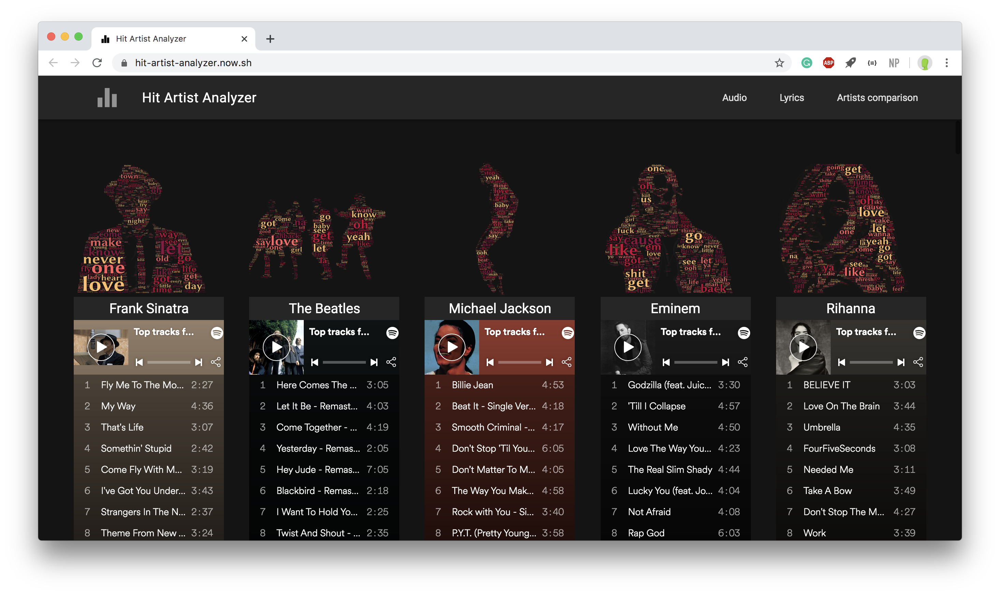

# Hit Artist Analyzer

#### Ever wondered what does Frank Sinatra, The Beatles, Michael Jackson, Eminem and Rihanna have in commons?

Check our Website [here](https://stanfurrer.github.io/Hit-Artist-Analyzer/website/build/index)
### Presentation video:

_The best solution if you got only two free minutes and no more_

<p align="center">
    <a href="https://www.youtube.com/watch?v=E69zIqW47ao">
        
    </a>
</p>

<p align="center">
    <a href="https://www.youtube.com/watch?v=E69zIqW47ao">Hit Artist Analyzer screencast</a>
</a>


## Getting started

Welcome. This repository contains the code for the project "Hit Artist Analyzer" made by Stanislas Furrer, Jonathan Besomi and Julien Salomon for the EPFL course <a href="https://edu.epfl.ch/coursebook/en/data-visualization-COM-480">Data visualization - COM-480</a>. Happy reading.


#### Execute website locally

The `website` folder contains all code to produce the end-result. To lunch it locally:

```
$ cd website/build
$ python3 -m http.server
```

In case you have <a href="https://www.browsersync.io/">`browser-sync`</a> installed you can type `./serve.sh` for live update on code changes. 


#### Spotify data download
To download the Spotify musical data from new artist, `spotipy` python package is required:

```
$ pip install spotipy
```

**Download new Spotify artist**:

1. Open `scraper.py` and insert the new artist into the ARTISTS array. 
2. Type the following command

```
$ cd spotify
$ python scraper.py
```

#### Lyrics preprocessing
For pre-processing the lyrical data, the following python package is required:

```
$ pip install lyricsgenius
```

**Download new lyrics**:

```
$ cd lyrics
$ python scaper.py --artist_name Eminem --max_songs 10
```

> Will download 10 lyrics from Eminem and store it under `./data/lyrics/Lyrics_Eminem_clean.csv`.


## Repository structure

#### Data

`data` Contains both Spotify and lyrics data used throughout the whole analysis. 

#### Lyrics

`lyrics` contains the code to scrape the lyrics from Genius.com.

#### Milestones

Two previous milestone markdown and files.

- [Milestone 1](/milestones/milestone_1.md)
- [Milestone 2](/milestones/milestone_2.md)
   - 2 pages PDF report: [milestone_2.pdf](/milestones/milestone_2.pdf)

#### Notebooks

`notebooks`

Collection of Jupyter Notebooks used during pre-processing and for different analysis.
 
#### Spotify

`spotify` contains the code to download data from Spotify as well as some already well-formatted exploratory data analysis notebooks.


#### Website

`website` contains all code to produce the [final website](https://stanfurrer.github.io/Hit-Artist-Analyzer/website/build/index).

All code live under `build` and the HTML/CSS and Javascript files are separated in their respective folders.

All code has been formatted with <a href="https://atom.io/packages/prettier-atom">prettifier-atom</a> for easy readability.


#### Widgets

The `widgets` contains the three core widgets shown in the final website.


# Team members

| Student's name  | SCIPER |
| --------------  | ------ |
| Stanislas Furrer| 239499 |
| Jonathan Besomi | 258689 |
| Julien Salomon  | 260233 |
